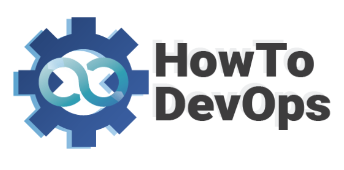

<!-- PROJECT LOGO -->

# Terraform Associate

## 📝 Conteúdo Programático :

- [ ] Linux - Comandos Básicos
- [ ] Entendendo Git
- [ ] Ferramentas de Build
- [ ] Cloud Computing
- [ ] Ferramentas de Build
- [ ] Artefatos
- [ ] Containers
- [ ] CI/CD
- [ ] Amazon Web Services - Básico
- [ ] Microsoft Azure Cloud - Básico
- [ ] Kubernetes
- [ ] Kubernetes No Azure
- [ ] Kubernetes No AWS
- [ ] Terraform
- [ ] Ansible

<!-- ABOUT THE PROJECT -->
## 🚀 Sobre o Projeto
 

  
  <h3 align="left"> <a href="https://howtodevops.io"> HowToDevOps.io </a> </h3>

 how to devops é um projeto pessoal que visa disseminar cada vez mais a cultura DevOps pela america latina para romper a barreira linguistica que por muitas vezes existe entre as pessoas de TI.

## 😄 Seja um dos contribuidores 

Quer fazer parte desse projeto? Clique [AQUI](CONTRIBUTING.md) e leia como contribuir.

## ☕ Quer me pagar um café ?

Esse projeto é 100% pessoal mas nada impede que me ajude a continuar motivado.

[⬆ Voltar ao topo](https://github.com/HowToDevOpsBr/terraform_associate#top) 

(<a href="#top">Voltar ao Topo</a>)

